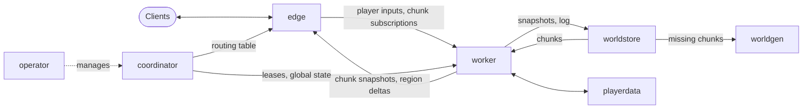

# Architecture

This document describes the intended design. The [roadmap](roadmap.md) says in which
order it is built, and [What exists so far](#what-exists-so-far) says how far that has
come.

## What exists so far

The edge, the worker, the world store and the coordinator exist and run either in one
process or as processes of their own, on Kubernetes or without. Since the first phase of
milestone M3 a region is durable: its worker shows players nothing that the world store
does not have on disk, another worker can carry on with it from there, and the edge
keeps its players meanwhile and resumes with whoever runs the region then; see
[ADR-0008](adr/0008-durable-regions-and-resuming.md). World generation is a flat world
inside the world store; `playerdata` and the operator do not exist yet.

Where the implementation is simpler than the design below:

| Design | So far |
|---|---|
| Regions of nearby active chunks that merge, split and migrate | Fixed stripes along the x axis, set when the cluster is started; see [ADR-0006](adr/0006-static-regions-and-handoff.md) |
| Boundaries only run through inactive gaps | A boundary can run past players. What they do to blocks on its other side is passed on to the region that has them and takes effect a tick or two later |
| Coordinator replicated with Raft, leases fenced everywhere | One coordinator with its state in memory; only the world store acts on epochs; see [ADR-0007](adr/0007-coordinator-scope.md) |
| Losing a worker is recovered from by migration | A waiting worker is given the region once the dead one's lease of 5 seconds is over and restores it from the world store; the region's players stand still meanwhile and stay connected. A region is moved on purpose the same way, with the old owner letting go first, so that nobody waits for the lease (`clustine move`, and every worker that is told to stop) |
| An edge can be lost without its players noticing | An edge that dies takes its players with it |
| Several edges | One edge; the workers can serve several, but there is no shared player list yet |
| Protobuf over gRPC, QUIC | One message format over TCP for everything |
| Trained zstd dictionaries, object storage | Plain zstd on the local file system |

## Principles

1. **One world, many workers.** Scaling out must not split the world into shards with
   visible borders.
2. **The tick hot path stays in-process.** A tick has 50 ms. Service boundaries sit around
   the simulation, never inside a region's tick.
3. **Exactly one owner per region.** Every piece of simulated state has a single writer at
   any time, enforced by fenced leases.
4. **Distribute first, add mechanics after.** Each game mechanic is written once, against
   the distributed model.
5. **Runs on a laptop.** Everything works as a single process without Kubernetes.

## Services

| Service | Responsibility | State |
|---|---|---|
| **edge** | Terminates client connections (authentication, encryption, compression). Translates inbound packets into semantic inputs for the worker owning the player's region. Fans region deltas out to players: interest management and packet encoding. | Live connections and a replica of the chunks its players can see |
| **coordinator** | Region ownership map and leases, merge/split/migrate decisions, load balancing, global world state (time, weather, game rules, player list). | Replicated with embedded Raft, three replicas |
| **worker** | Ticks the regions it owns, each on its own tick loop in a thread pool. The only place simulation happens. | Authoritative in-memory region state |
| **worldstore** | Serves and persists chunks, snapshots and write-ahead logs. | Durable |
| **worldgen** | Generates chunks that do not exist yet. | Stateless |
| **playerdata** | Profiles, inventories, statistics, advancements; one lease per player. | Durable |
| **operator** | Reconciles `ClustineCluster` and `ClustineWorld` resources: scaling, drain, upgrades. | Kubernetes API |

Edge combines the gateway and fan-out roles. They may be split into two services if
dense-crowd benchmarks show they need to scale independently.

The worker never sees a Minecraft packet. The interface between edge and worker is
described in [ADR-0005](adr/0005-edge-worker-interface.md).

The `clustine` binary runs all services in one process for development and small servers.

## Region model

A **region** is a set of nearby active chunks and is the unit of ownership, ticking and
migration.

- **Merging.** Regions closer than a threshold merge. Boundaries therefore only run
  through inactive gaps, and behaviour inside a region is identical to a single server.
- **Splitting.** A region whose active chunks drift apart splits into independent regions.
- **Ownership.** The coordinator grants each region to one worker with a lease and an
  epoch. Storage and peers reject writes carrying an older epoch, so a worker that lost
  its lease cannot corrupt state.
- **Cross-worker merge.** When regions on different workers approach each other, the
  coordinator migrates the smaller one to the other worker first; the merge is then local.
- **Migration.** Pause at a tick boundary, ship a snapshot and the log tail, bump the
  epoch, resume on the new owner. Graceful drain, rolling updates and crash recovery all
  use this mechanism.
- **Entity transfer.** An entity or player moving between regions on different workers is
  handed over in two phases so it is never duplicated or lost. The edge reroutes the
  player's connection without a reconnect.
- **Tick rate.** Each region has its own tick clock. An overloaded region slows down alone
  instead of lagging the cluster.

### Determinism

A region tick should be a pure function of the previous region state and that tick's
inputs (player packets, global state, messages from other regions, a per-region seeded
random stream). This allows replay debugging, migration by "snapshot plus log tail", hot
standbys and differential testing against the vanilla server. It is a design goal from the
first milestone; whether it becomes a hard guarantee is decided once dynamic regions exist.

### Limits

A single region runs on a single worker, so a very dense area is bounded by one machine's
simulation capacity. Two measures address this:

- The fan-out work, which dominates with large crowds, happens on the edge tier, not on
  the worker.
- Exchanging boundary state between workers every tick (halo exchange), which would allow
  one region to span workers, is a later research goal.

## World format

What is implemented so far is specified in [world-format.md](world-format.md); this
section describes where the format is going.

- **Sections.** The unit of storage is a 16×16×16 section, palette-compressed and
  compressed with zstd using trained dictionaries.
- **Content addressing.** Sections are stored by hash and referenced from a per-chunk
  manifest. Identical sections are stored once; snapshots and branches of a world copy
  manifests, not data.
- **Write-ahead log.** Each region appends its changes to a log, which is periodically
  compacted into sections. This gives crash recovery, point-in-time restore and a block
  audit log.
- **Backends.** Storage sits behind a trait: local filesystem first, then object storage
  with a metadata key-value store.
- **Interoperability.** An import/export tool converts from and to the Anvil format.

## Transport

- Control plane: Protobuf over gRPC.
- Per-tick data between worker and edge: framed streams over QUIC or TCP.
- No external message broker is required for the core.

## Vanilla parity

- Ids and names of packets, block states, registry entries and tags are generated from the
  official server jar's data generator by `tools/datagen` and committed as Rust tables
  ([ADR-0004](adr/0004-game-data.md)). The jar and its data pack are never redistributed.
- `difftest` runs the vanilla server with the same seed and inputs and compares chunk
  hashes, redstone outcomes and entity behaviour.
- Progress is tracked in the [parity matrix](parity-matrix.md).

## Plugins

Planned after the simulation API is stable:

- A native API that is cluster-aware from the start: handlers run on the worker owning
  the region, with cluster-wide key-value storage, publish/subscribe and tasks that run on
  exactly one node.
- WebAssembly components as the plugin format: sandboxed, language-independent and able
  to migrate with a region.
- A JVM bridge exposing the Folia flavour of the Bukkit API for plugins that use only the
  public API.

## Kubernetes

- Autoscaling on tick time and region load reported by the coordinator, not on CPU.
- Pod termination drains a worker by migrating its regions away first.
- Rolling updates replace workers one at a time with no player disconnects.
- Metrics in Prometheus format and tracing with OpenTelemetry, including per-region tick time.
